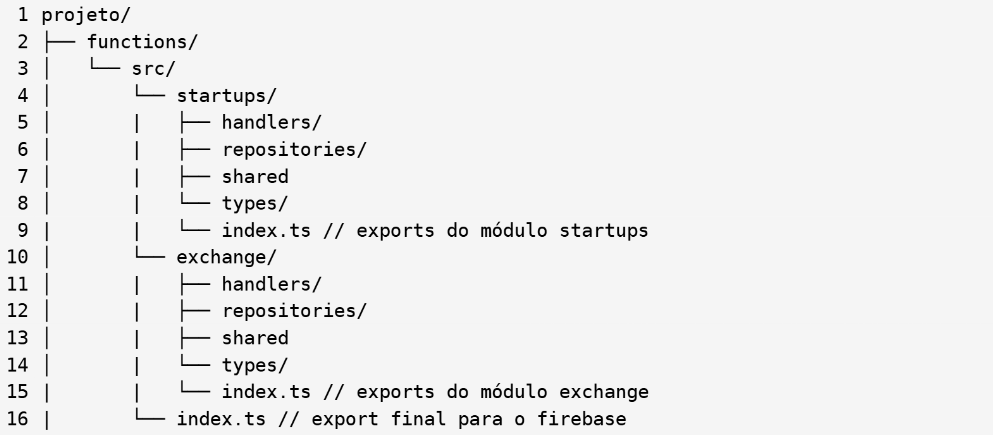
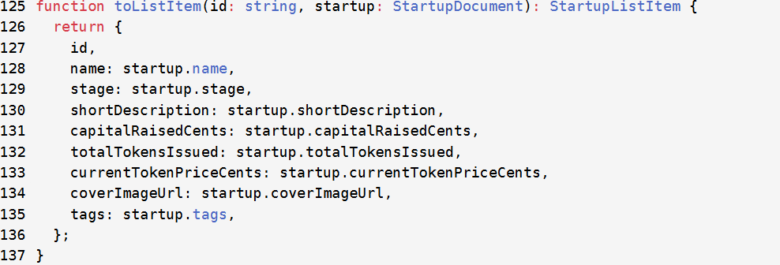

## Anotações Aula - TDD

- Se testa todas as partes primeiro para que assim se integre primeiro

- Utiliza-se testes unitários para achar problemas, principalmente em MVPs para evitar erros futuros

- Tudo começa no widget_test.dart

- Testar o backend "de fora dele" para testar velocidade de conexão, latência e afins (recomenadado mas se testa em ambos)

- Separados por grupos, onde cada grupo testa individualmente cada parte (tela, integração...)

- Grupo: vários testes agrupados que testam partes epecíficas da aplicação

- Teste não se roda em produção, no máximo em ambiente de "homologação", ambiente igual de produção mas que pode haver erros

- No P.I testar local após subir em prod, mas em ambiente real não, mesmo esquema do Nola

- Habilitar um app check

- Colocar sempre hard code um usuário de teste

- O grupo de testes geralmente tem diversos métodos (test) que são casos de testes 

- Para que os casos de teste funcionem, muitas vezes precisamos fazer uma espécie de setup

- O setup prepara o ambiente para os testes rodarem

- Um caso de teste testa apenas uma única coisa

- Todas as functiosn retornam um JSON como resultado

- Teste é arma contra programador porco

- Fazer casos de chamada com parâmetro errado, e muitas outras coisas 

- Modelo de repositório de Firebase Functions

- handlers: Nesse diretório estão as firebase functions. Uma por arquivo, nada de juntar tudo em um arquivo
gigante.

- repositories: Toda comunicação com o Firebase Firestore, é via repositório de dados. Por isso temos um
padrão para manter isso separado das functions em si (mas eles prestam serviço às firebase functions - são
usados nos handlers).

- shared: arquivos em comum compartilhados entre os diretórios.

- types: tipos específicos deste contexto (startups), type, interface, classes.

- arquivo index.ts: exportação do módulo.

- Estudar os providers, tipos de provedores, do Firebase Auth

- Cada arquivo dentro do handler é uma function, e tem o mesmo nome da function

- Estudar o onCall de dentro do pacote HTTPS

- Cai na prova

- **Tarefa para começar hoje e acabar semana que vem:**
    - Parte 1: 
            - Criar um novo projeto no firebase chamado mesclaInvestv2
            - Preparar o projeto de functions usando o firebase init
            - Criar os códigos das functions para startups exatamente copiando e colando o código do professor que está no pdf da aula 7 (aula7-firebase-functions-tdd.pdf)
    
    - Parte 2: 
            - Fazer as functions funcionarem no emulador local do firebase
            - Criar um projeto flutter chamado mesclaInvest_tests e nele colocar os testes unitários fornecidos pelo professor