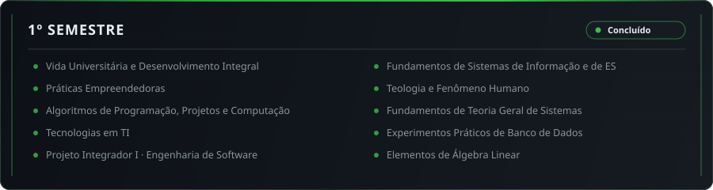
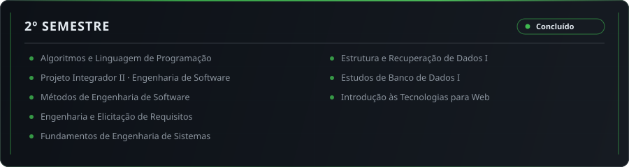
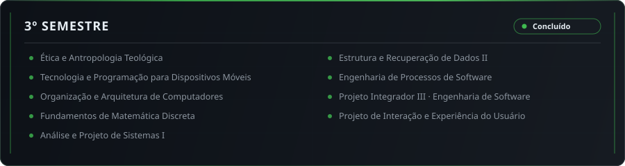
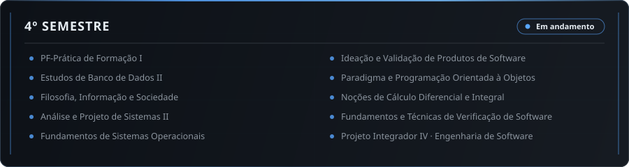
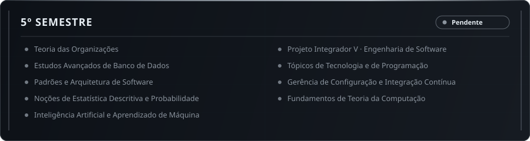
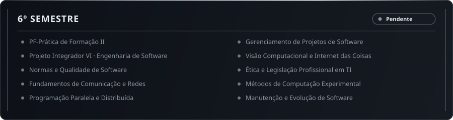
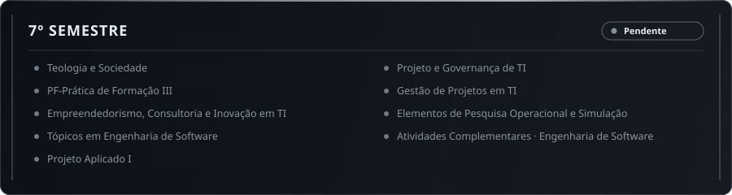
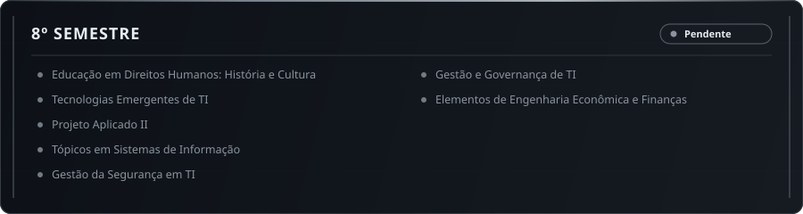

<!-- Pedro Soler — Engenharia de Software · PUC-Campinas -->

  

  &nbsp;&nbsp;
  &nbsp;&nbsp;
  

 

  

 

 

<h2 align="center">
  
</h2>

  

 

 

<h2 align="center">
  
</h2>

  

 

  

 

  

 

 

<h2 align="center">
  
</h2>

 

  

 

  

 

  

 

  

 

  

 

  

 

  

 

  

 

 

  

  <a href="https://www.linkedin.com/in/pedro-henrique-contardi-soler/" target="_blank">LinkedIn</a> &middot;
  <a href="mailto:pedrocsoler@hotmail.com">pedrocsoler@hotmail.com</a> &middot;
  <a href="https://solerpedroo.github.io/portfolio-pedro/" target="_blank">Portfolio</a>

