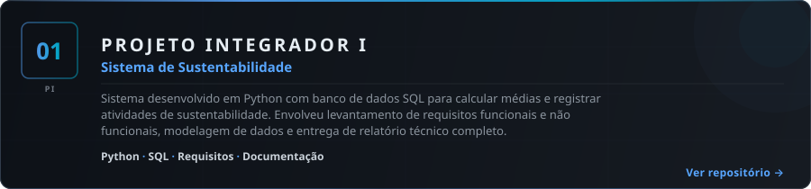
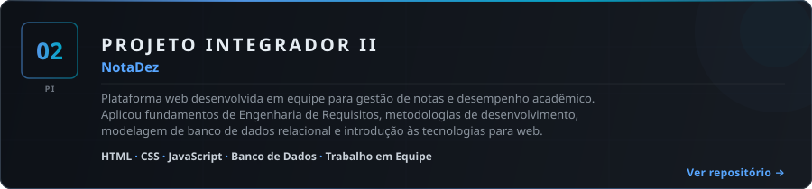
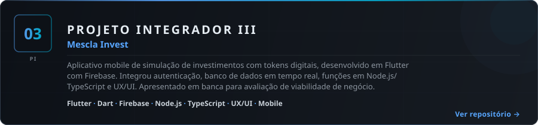

<!-- Pedro Soler — Engenharia de Software · PUC-Campinas -->

  

  &nbsp;&nbsp;
  &nbsp;&nbsp;
  

 

  

 

 

<h2 align="center">
  
</h2>

  

 

 

<h2 align="center">
  
</h2>

  

 

  

 

  

 

 

<h2 align="center">
  
</h2>

 

  
<strong>1º Semestre · Concluído</strong>

   

  | Disciplina |
  |---|
  | Vida Universitária e Desenvolvimento Integral |
  | Práticas Empreendedoras |
  | Algoritmos de Programação, Projetos e Computação |
  | Tecnologias em TI |
  | Projeto Integrador I · Engenharia de Software |
  | Fundamentos de Sistemas de Informação e de Engenharia de Software |
  | Teologia e Fenômeno Humano |
  | Fundamentos de Teoria Geral de Sistemas |
  | Experimentos Práticos de Banco de Dados |
  | Elementos de Álgebra Linear |

 

  
<strong>2º Semestre · Concluído</strong>

   

  | Disciplina |
  |---|
  | Algoritmos e Linguagem de Programação |
  | Projeto Integrador II · Engenharia de Software |
  | Métodos de Engenharia de Software |
  | Engenharia e Elicitação de Requisitos |
  | Fundamentos de Engenharia de Sistemas |
  | Estrutura e Recuperação de Dados I |
  | Estudos de Banco de Dados I |
  | Introdução às Tecnologias para Web |

 

  
<strong>3º Semestre · Concluído</strong>

   

  | Disciplina |
  |---|
  | Ética e Antropologia Teológica |
  | Tecnologia e Programação para Dispositivos Móveis |
  | Organização e Arquitetura de Computadores |
  | Fundamentos de Matemática Discreta |
  | Análise e Projeto de Sistemas I |
  | Estrutura e Recuperação de Dados II |
  | Engenharia de Processos de Software |
  | Projeto Integrador III · Engenharia de Software |
  | Projeto de Interação e da Experiência do Usuário de Software |

 

  
<strong>4º Semestre · Em andamento</strong>

   

  | Disciplina |
  |---|
  | PF-Prática de Formação I |
  | Estudos de Banco de Dados II |
  | Filosofia, Informação e Sociedade |
  | Análise e Projeto de Sistemas II |
  | Fundamentos de Sistemas Operacionais |
  | Ideação e Validação de Produtos de Software |
  | Paradigma e Programação Orientada à Objetos |
  | Noções de Cálculo Diferencial e Integral |
  | Fundamentos e Técnicas de Verificação e Validação de Software |
  | Projeto Integrador IV · Engenharia de Software |

 

  
<strong>5º Semestre · Pendente</strong>

   

  | Disciplina |
  |---|
  | Teoria das Organizações |
  | Estudos Avançados de Banco de Dados |
  | Padrões e Arquitetura de Software |
  | Noções de Estatística Descritiva e Probabilidade |
  | Inteligência Artificial e Aprendizado de Máquina |
  | Projeto Integrador V · Engenharia de Software |
  | Tópicos de Tecnologia e de Programação |
  | Gerência de Configuração, Entrega e Integração Contínua |
  | Fundamentos de Teoria da Computação e Análise de Algoritmos |

 

  
<strong>6º Semestre · Pendente</strong>

   

  | Disciplina |
  |---|
  | PF-Prática de Formação II |
  | Projeto Integrador VI · Engenharia de Software |
  | Normas e Qualidade de Software |
  | Fundamentos de Comunicação de Dados e Redes de Computadores |
  | Programação Paralela e Distribuída |
  | Gerenciamento de Projetos de Engenharia de Software |
  | Visão Computacional e Internet das Coisas |
  | Ética e Legislação Profissional em TI |
  | Métodos de Computação Experimental e Quantitativa |
  | Manutenção e Evolução de Software |

 

  
<strong>7º Semestre · Pendente</strong>

   

  | Disciplina |
  |---|
  | Teologia e Sociedade |
  | PF-Prática de Formação III |
  | Empreendedorismo, Consultoria e Inovação em TI |
  | Tópicos em Engenharia de Software |
  | Projeto Aplicado I |
  | Projeto e Governança de TI |
  | Gestão de Projetos em TI |
  | Elementos de Pesquisa Operacional e de Simulação |
  | Atividades Complementares · Engenharia de Software |

 

  
<strong>8º Semestre · Pendente</strong>

   

  | Disciplina |
  |---|
  | Educação em Direitos Humanos: História, Cultura e Meio Ambiente |
  | Tecnologias Emergentes de TI |
  | Projeto Aplicado II |
  | Tópicos em Sistemas de Informação |
  | Gestão da Segurança em TI |
  | Gestão e Governança de TI |
  | Elementos de Engenharia Econômica e Finanças |

 

 

  

  <a href="https://www.linkedin.com/in/pedro-henrique-contardi-soler/">LinkedIn</a> &middot;
  <a href="mailto:pedrocsoler@hotmail.com">pedrocsoler@hotmail.com</a> &middot;
  <a href="https://solerpedroo.github.io/portfolio-pedro/">Portfolio</a>

